# LetsGoto — System Design Document

> **Platform:** Full-Stack Travel Booking Platform  
> **Domain:** `letsgoto.in` (User) · `partner.letsgoto.in` (Partner) · `admin.letsgoto.in` (Admin)  
> **Last Updated:** April 2026

---

## Table of Contents

1. [System Overview](#1-system-overview)
2. [High-Level Architecture](#2-high-level-architecture)
3. [Frontend Architecture](#3-frontend-architecture)
4. [Backend Architecture](#4-backend-architecture)
5. [Domain Model & Data Design](#5-domain-model--data-design)
6. [API Design](#6-api-design)
7. [Authentication & Authorization](#7-authentication--authorization)
8. [Real-Time Layer (Socket.IO)](#8-real-time-layer-socketio)
9. [File Storage & AI/OCR Pipeline](#9-file-storage--aiocr-pipeline)
10. [Booking & Availability Engine](#10-booking--availability-engine)
11. [Payment & Pricing Engine](#11-payment--pricing-engine)
12. [Security Architecture](#12-security-architecture)
13. [Infrastructure & Deployment](#13-infrastructure--deployment)
14. [CI/CD Pipeline](#14-cicd-pipeline)
15. [Observability & Monitoring](#15-observability--monitoring)
16. [Scalability & Performance](#16-scalability--performance)
17. [Key Design Decisions](#17-key-design-decisions)

---

## 1. System Overview

LetsGoto is a **multi-portal travel booking platform** serving three distinct user groups:

| Portal | URL | Users | Responsibility |
|---|---|---|---|
| **User App** | `letsgoto.in` | Travelers | Browse properties, book stays, manage bookings & payments |
| **Partner App** | `partner.letsgoto.in` | Property owners | List properties, manage rooms/availability, handle bookings |
| **Admin App** | `admin.letsgoto.in` | Platform admins | KYC review, platform settings, partner management, analytics |

### Core Capabilities

- Property discovery with rooms, packages, meal plans, and activities
- Multi-room, multi-night booking with dynamic pricing and availability enforcement
- Partner onboarding with AI-powered Aadhaar (KYC) verification
- Real-time notifications and partner presence tracking via WebSockets
- Razorpay payment integration with platform fee and tax calculation
- Review and rating system with verified booking enforcement
- Centralized admin panel for governance, user management, and system settings

---

## 2. High-Level Architecture

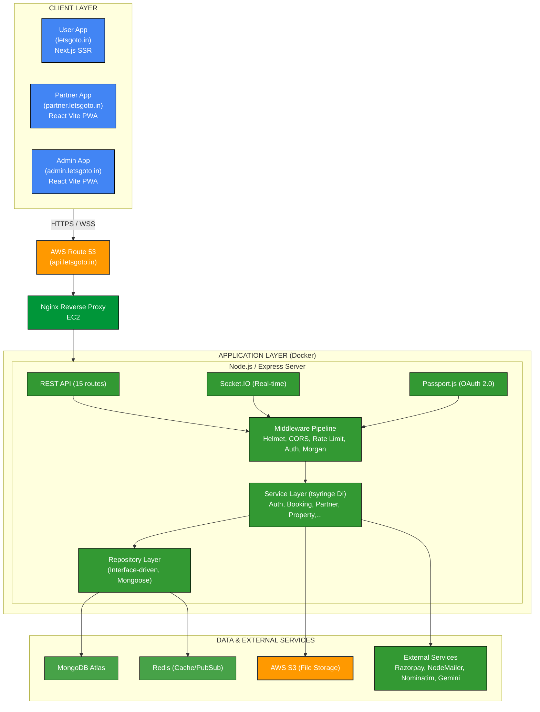

---

## 3. Frontend Architecture

### 3.1 User App — `travel_hub_next` (Next.js 16)

**Rendering strategy:** Server-Side Rendering (SSR) for SEO-critical pages (property listings, destinations), Client-Side Rendering for interactive booking flows.

```
travel_hub_next/
├── src/
│   ├── app/           # App Router pages (SSR)
│   ├── components/    # Reusable UI components
│   └── lib/           # API clients, hooks, utils
├── next.config.ts
└── tailwind.config.ts
```

**Key dependencies:**
- `next` 16.1.1 · `react` 19 — Core framework
- `framer-motion` — Page transitions and micro-animations
- `react-leaflet` + `leaflet` — Interactive property maps
- `react-calendar` — Date picker for booking flows
- `react-hot-toast` + `sonner` — Toast notifications
- `axios` — HTTP client with interceptors
- `tailwindcss` — Utility-first styling

### 3.2 Partner App — `partner_web` (React Vite PWA)

Dashboard for property owners. Built as a Progressive Web App for offline resilience and native-app feel on mobile.

**Responsibilities:**
- Property & room CRUD with image upload
- Availability calendar management with custom pricing per date
- Booking inbox with approve/reject/check-in/check-out lifecycle
- Aadhaar KYC document upload workflow
- Revenue and booking analytics

### 3.3 Admin App — `admin` (React Vite PWA)

Internal governance panel.

**Responsibilities:**
- Partner KYC review (approve/reject Aadhaar documents)
- User and partner management (ban/activate)
- Global system settings (platform fee %, tax rate %, maintenance mode, auto-approve toggle, 2FA toggle)
- Booking oversight and refund processing
- Real-time partner presence monitoring via WebSocket

---

## 4. Backend Architecture

### 4.1 Layered Monolith Pattern

The backend follows a strict **4-layer architecture** enforced through TypeScript interfaces:

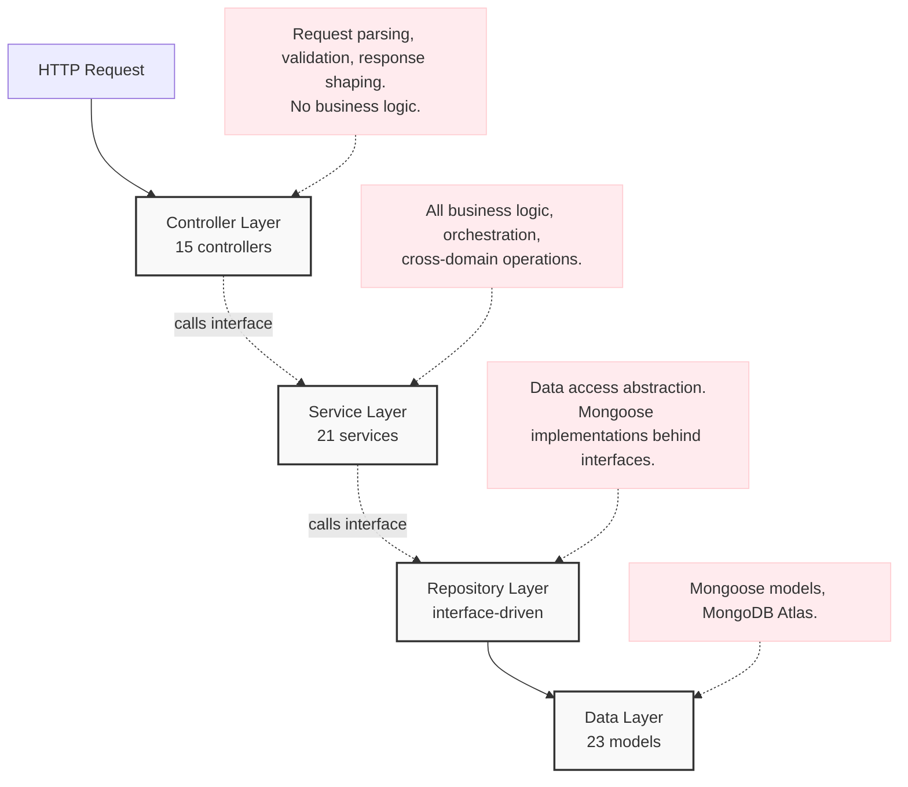

### 4.2 Dependency Injection (tsyringe)

All services and repositories are registered in a central IoC container (`src/container/container.ts`) and resolved via `@injectable()` / `@inject()` decorators. This enables:

- **Testability** — repositories can be swapped for mocks in tests
- **Configurability** — OCR service selected at startup via `config.useGeminiOCR` flag
- **Loose coupling** — controllers depend only on interfaces, not implementations

```typescript
// Runtime selection of OCR implementation
@inject(config.useGeminiOCR ? 'GeminiOCRService' : 'OCRService')
private ocrService: IOCRService
```

### 4.3 Service Inventory

| Service | Responsibility |
|---|---|
| `AuthService` | User register/login, JWT lifecycle, 2FA, OTP, session tracking |
| `PartnerService` | Partner onboarding, Aadhaar KYC flow, token management |
| `PropertyService` | CRUD for properties with image upload and multi-field search |
| `RoomService` | Room CRUD with capacity and pricing metadata |
| `BookingService` | Price calculation, booking creation, lifecycle state machine |
| `AvailabilityService` | Room availability calendar, date blocking, custom pricing |
| `PaymentService` | Razorpay order creation and payment verification |
| `ReviewService` | Verified-booking reviews with rating aggregation |
| `DestinationService` | Curated destination catalog management |
| `LocationService` | Geocoding proxy, partner location tracking via Socket |
| `PackageService` | All-inclusive package catalog per property |
| `MealPlanService` | Per-person, per-day meal plan options |
| `ActivityService` | Add-on activities with per-person pricing |
| `AdminService` | Platform-wide analytics, governance, stats aggregation |
| `UserService` | User profile, wishlist, session history |
| `RedisService` | Cache get/set/delete abstraction over ioredis |
| `SocketService` | Real-time event routing across roles (users, partners, admins) |
| `GeminiOCRService` | Aadhaar data extraction via Google Gemini Vision (primary) |
| `OCRService` | Aadhaar data extraction via Tesseract.js (fallback) |
| `EmailNotificationService` | Transactional email templates (Nodemailer) |
| `EmailService` | Lower-level SMTP send abstraction |

### 4.4 Middleware Pipeline

All requests pass through the following ordered middleware stack:

```
Incoming Request
    ├── Helmet           → Secure HTTP headers (HSTS, CSP, X-Frame-Options)
    ├── CORS             → Origin whitelist with credentials support
    ├── Morgan (HTTP)    → Structured request logging
    ├── Maintenance Mode → Global kill switch (SystemSetting model)
    ├── Rate Limiter     → express-rate-limit (configurable per route)
    ├── Timeout Handler  → 5-minute timeout for /register and /upload
    ├── Body Parser      → JSON + URL-encoded (10MB limit)
    ├── Cookie Parser    → Signed cookie support
    └── Route Handlers   → Controller dispatch
```

---

## 5. Domain Model & Data Design

### 5.1 Entity Relationship Overview

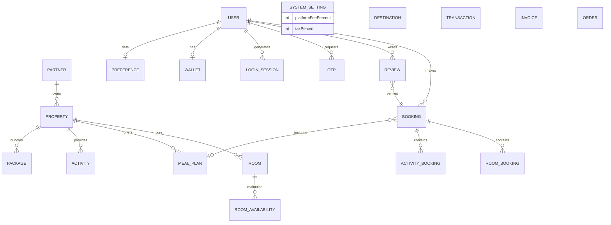

### 5.2 Core Document Schemas

#### `Partner`
| Field | Type | Notes |
|---|---|---|
| `partnerId` | String | Auto-generated `PRT{timestamp}{random}` |
| `personalDocuments.aadharFront` | String (S3 URL) | Private bucket |
| `personalDocuments.aadharBack` | String (S3 URL) | Private bucket |
| `personalDocuments.aadharStatus` | Enum | `pending` · `approved` · `rejected` · `manual_review` |
| `aadharDetails.*` | String (encrypted) | AES-encrypted at-rest fields extracted by OCR |
| `aadhaarVerified` | Boolean | Gate for property creation |
| `maxProperties` | Number | Platform-imposed cap (default: 5) |
| `bankingDetails` | Object | Partner payout info |
| `status` | Enum | `pending` · `verified` · `rejected` |

#### `Property`
| Field | Type | Notes |
|---|---|---|
| `propertyId` | String | Human-readable ID |
| `partnerId` | ObjectId | Owner reference |
| `propertyType` | Enum | Hotel, Resort, Villa, Homestay, etc. |
| `location`, `address`, `coordinates` | Object | Geocoded |
| `amenities[]`, `images[]` | Array | S3 URLs for images |
| `isActive`, `isApproved` | Boolean | Admin approval gate |

#### `Booking`
| Field | Type | Notes |
|---|---|---|
| `bookingId` | String | `BKG{YYYYMMDD}{4-digit-random}` |
| `status` | Enum | `pending_payment` → `confirmed` → `checked_in` → `checked_out` → `completed` / `cancelled` / `rejected` |
| `paymentStatus` | Enum | `pending` · `paid` · `refunded` |
| `roomBookings[]` | Array | Per-room price snapshot |
| `activityBookings[]` | Array | Per-activity price snapshot |
| `platformFee`, `taxAmount`, `finalPrice` | Number | Dynamic from SystemSetting |

#### `RoomAvailability`
| Field | Type | Notes |
|---|---|---|
| `date` | Date | One document per blocked date |
| `isBlocked` | Boolean | |
| `blockedReason` | Enum | `booking` · `maintenance` · `manual` |
| `bookingId` | ObjectId | Reference to blocking booking |
| `customPricing` | Object | Per-date price override |

#### `SystemSetting` (singleton)
| Field | Purpose |
|---|---|
| `platformFeePercent` | Global platform fee applied to all bookings |
| `taxPercent` | GST / tax rate |
| `maintenanceMode` | Toggles maintenance middleware |
| `twoFactorAuth` | Enables 2FA for admin logins |
| `autoApprovePartners` | Bypasses manual KYC review |

---

## 6. API Design

### 6.1 Base URL
```
https://api.letsgoto.in/api/v1/
```

### 6.2 Route Modules

| Prefix | Controller | Auth Required |
|---|---|---|
| `/auth` | AuthController | Public (mixed) |
| `/partner` | PartnerController | Partner JWT |
| `/users` | UserController | User JWT |
| `/admin` | AdminController | Admin JWT |
| `/properties` | PropertyController | Mixed |
| `/properties/:id/rooms` | RoomController | Partner JWT (write) |
| `/properties/:id/meal-plans` | MealPlanController | Partner JWT (write) |
| `/properties/:id/activities` | ActivityController | Partner JWT (write) |
| `/properties/:id/packages` | PackageController | Partner JWT (write) |
| `/bookings` | BookingController | User JWT |
| `/payments` | PaymentController | User JWT |
| `/reviews` | ReviewController | User JWT (write) |
| `/destinations` | DestinationController | Mixed |
| `/upload` | Upload middleware | JWT |
| `/geocode/pincode` | Inline handler | Public |

### 6.3 Response Format

All responses follow a consistent envelope:

```json
{
  "success": true,
  "message": "Human-readable status",
  "data": { ... },
  "pagination": { "page": 1, "limit": 10, "total": 100 }
}
```

Errors:
```json
{
  "success": false,
  "message": "Validation failed",
  "statusCode": 400,
  "errors": [ ... ]
}
```

---

## 7. Authentication & Authorization

### 7.1 Token Strategy

The platform uses a **dual-token JWT** system:

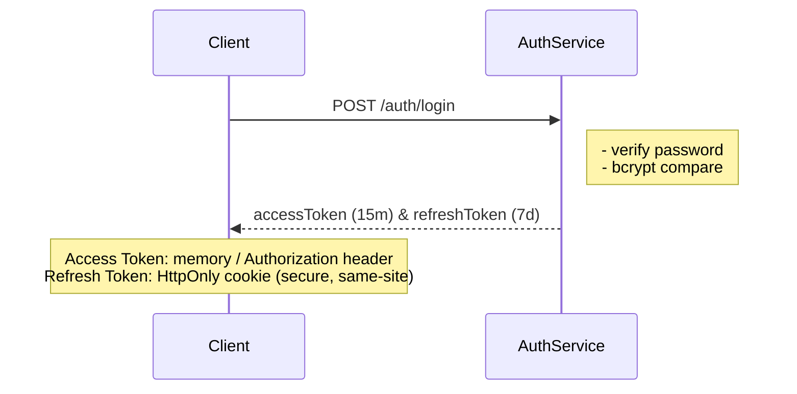

**Token payload:**
```typescript
{
  userId: string,
  email: string,
  role: 'customer' | 'partner' | 'admin'
}
```

### 7.2 Auth Flows by Role

**User (email + password):**
```
Register → OTP sent to email → Verify email OTP → Active account
Login → JWT pair issued → Refresh on expiry
```

**Partner (OTP-only passwordless):**
```
Register (basic info) → Aadhaar KYC upload → Admin review
Login → Email OTP → Verify OTP → JWT pair issued
```

**Admin (2FA-capable):**
```
Login (email + password) → If 2FA enabled in SystemSetting:
  → Email OTP sent → Verify OTP → JWT pair issued
  Else → JWT pair issued directly
Admin session tracked in LoginSession collection
```

### 7.3 Middleware Guards

| Middleware | Validates |
|---|---|
| `auth.ts` | JWT for user/admin routes |
| `partnerAuth.ts` | JWT + partner role + Aadhaar verification status |
| `authenticateAdmin.ts` | JWT + admin role |

### 7.4 Google OAuth 2.0

`passport-google-oauth20` strategy mounted on auth routes for social login flow.

### 7.5 Session Tracking

Every admin login stores a `LoginSession` document including IP, device, OS, browser (parsed from `User-Agent`), allowing the admin dashboard to show active sessions and revoke them.

---

## 8. Real-Time Layer (Socket.IO)

### 8.1 Architecture

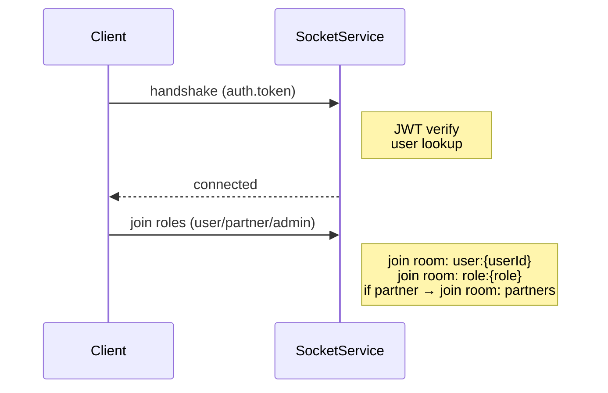

### 8.2 Room Architecture

```
user:{userId}        ← Personal notifications per user
role:{role}          ← Broadcast by role (customer, partner, admin)
partners             ← All connected partners
admins               ← Admin monitoring room
order:{orderId}      ← Order-specific updates and partner location
```

### 8.3 Event Catalog

| Event | Direction | Payload |
|---|---|---|
| `notification` | Server → Client | `{ type, title, message }` |
| `order_update` | Server → Client | `{ orderId, status, ... }` |
| `partner_location_update` | Server → Order Room | `{ coordinates, heading, speed }` |
| `partner_online` | Server → Admins | `{ userId }` |
| `partner_offline` | Server → Admins | `{ userId }` |
| `PARTNER_AADHAAR_SUBMITTED` | Server → Admins | `{ partnerId }` |
| `PARTNER_VERIFICATION_APPROVED` | Server → Partners | `{ partnerId, email }` |
| `PARTNER_VERIFICATION_REJECTED` | Server → Partners | `{ partnerId, reason }` |
| `location_update` | Partner → Server | `{ coordinates, heading, orderId }` |
| `send_message` | Client → Server | `{ recipientId, message, orderId }` |
| `new_message` | Server → Client | `{ senderId, message, timestamp }` |
| `join_order_room` / `leave_order_room` | Client → Server | `orderId` |

---

## 9. File Storage & AI/OCR Pipeline

### 9.1 S3 Upload Architecture

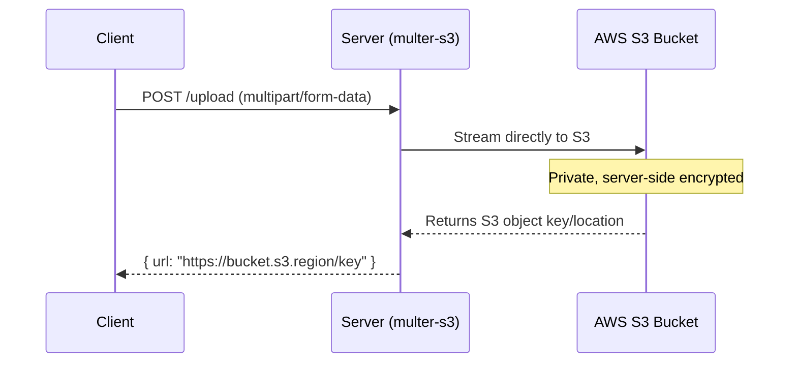

**Upload categories** (each with distinct S3 prefix):
- `partners/profile/` — Partner profile pictures
- `partners/documents/aadhar/` — Aadhaar front/back (private)
- `properties/images/` — Property listing photos
- `rooms/images/` — Room photos

Signed URLs (1-hour TTL) are generated on-demand for private documents via `@aws-sdk/s3-request-presigner`.

### 9.2 AI/OCR KYC Pipeline

```mermaid
flowchart TD
    Start([Partner uploads Aadhaar images to S3<br>POST /partner/verify-aadhar]) --> PS[PartnerService.verifyAadhar]
    
    PS --> Switch{Config: useGeminiOCR?}
    Switch -- Yes --> Gemini[GeminiOCRService<br>Google Gemini 1.5 Flash]
    Switch -- No --> Tesseract[OCRService<br>Tesseract.js local fallback]
    
    Gemini --> AWSSDK[AWS SDK GetObjectCommand<br>Fetch image from S3, Convert to Base64]
    AWSSDK --> GeminiAPI[Gemini Vision API<br>Structured prompt -> JSON response]
    GeminiAPI --> ExtractedData
    Tesseract --> ExtractedData
    
    ExtractedData[{Extracted: aadharNumber, fullName, dob, gender, isVerified}] --> Encrypt[AES Encrypt sensitive fields]
    Encrypt --> Store[Store encrypted in MongoDB]
    
    Store --> CheckStatus{SystemSetting:<br>autoApprovePartners?}
    CheckStatus -- Yes --> Approved[aadharStatus = 'approved']
    CheckStatus -- No --> ManualReview[aadharStatus = 'manual_review'<br>Admin reviews in dashboard]
    
    Approved --> Broadcast[Socket: broadcastToAdmins<br>'PARTNER_AADHAAR_SUBMITTED']
    ManualReview --> Broadcast
```

**Encryption:** All extracted Aadhaar fields (number, name, DOB, gender) are AES-encrypted using a secret key before being stored in MongoDB. The `personalDocuments` fields store only the S3 URL of the image, never plaintext PII.

---

## 10. Booking & Availability Engine

### 10.1 Booking State Machine

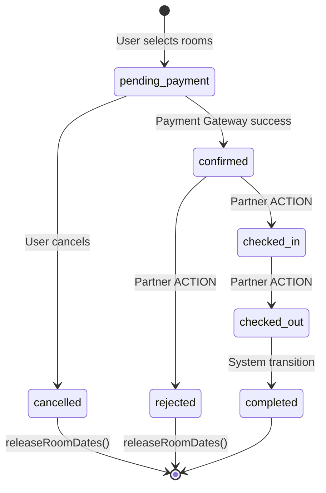

### 10.2 Price Calculation Algorithm

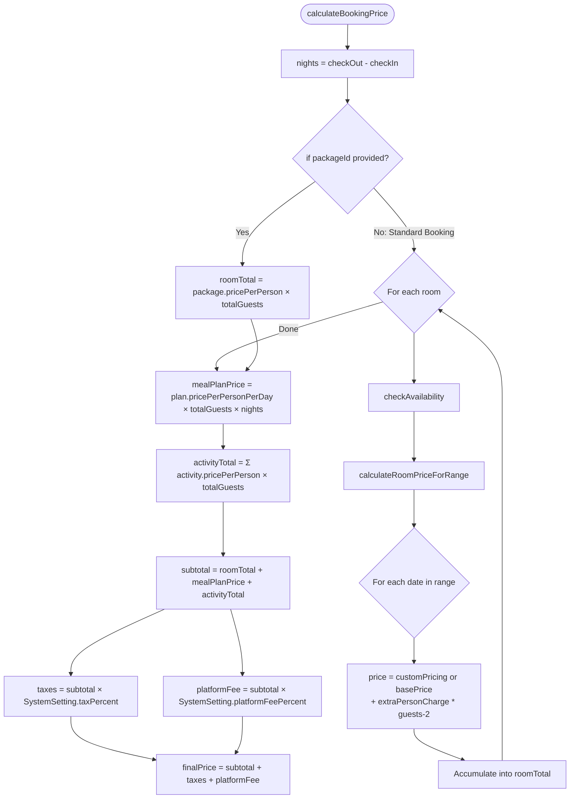

### 10.3 Availability & Date Blocking

Each blocked date is stored as an individual `RoomAvailability` document, enabling O(1) lookups per date:

```
checkAvailability(roomId, checkIn, checkOut):
    for each date in [checkIn, checkOut):
        if blocked:
            if reason === 'booking' AND booking.status === 'pending_payment':
                if booking.createdAt < (now - 15min): skip  ← auto-release stale holds
                if booking.userId === currentUser: skip       ← allow re-selection
            else: return FALSE
    return TRUE
```

**Key rule:** A `pending_payment` booking holds dates for **15 minutes**. After that, the dates are treated as available, preventing abandoned carts from freezing inventory.

---

## 11. Payment & Pricing Engine

### 11.1 Razorpay Integration Flow

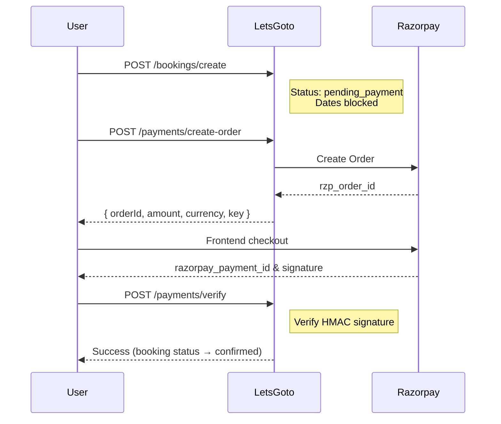

### 11.2 Platform Fees & Tax

Both platform fee and tax rates are stored in the `SystemSetting` singleton and applied dynamically at price calculation time — no hardcoded rates in service logic.

### 11.3 Refund Flow

```
User: POST /bookings/:id/refund-request
    → refundStatus: 'requested'

Admin: POST /admin/bookings/:id/process-refund { approved: true }
    → refundStatus: 'approved'
    → paymentStatus: 'refunded'
    → refundAmount = finalPrice (full refund by default)
```

---

## 12. Security Architecture

### 12.1 Defence in Depth

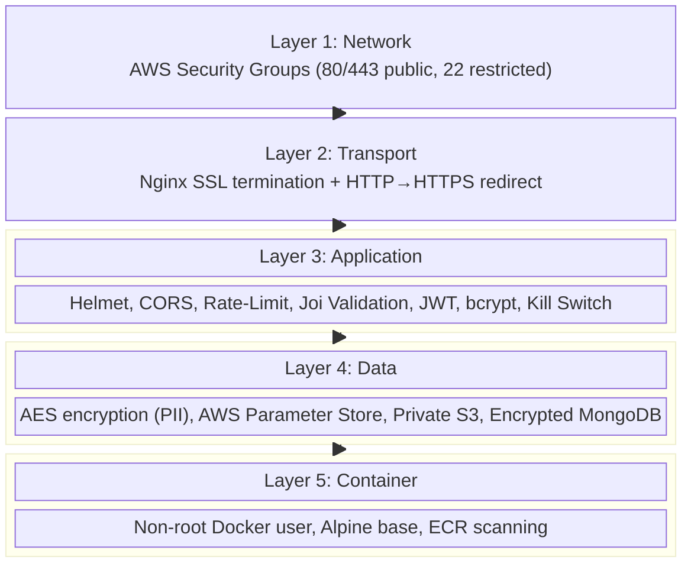

### 12.2 Sensitive Data Handling

| Data | Storage | Protection |
|---|---|---|
| User passwords | MongoDB | bcrypt hash |
| JWT secrets | AWS Parameter Store | Encrypted at rest |
| Aadhaar number, name, DOB | MongoDB `aadharDetails` | AES encrypted |
| Aadhaar card images | AWS S3 (private bucket) | Signed URL access only |
| Bank account details | MongoDB `bankingDetails` | Encrypted fields |
| API keys (Razorpay, Gemini, AWS) | Environment / Parameter Store | Never committed to Git |

---

## 13. Infrastructure & Deployment

### 13.1 AWS Infrastructure

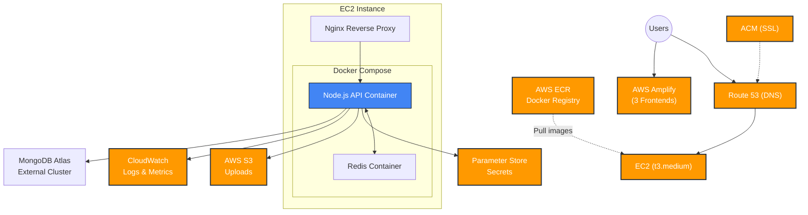

### 13.2 Docker Configuration

**Multi-stage Dockerfile** (production):
1. **Build stage** — TypeScript compilation (`tsc`)
2. **Production stage** — Alpine base, only `node_modules --production`, non-root user

**docker-compose.yml** (local & EC2):
```yaml
services:
  app:     # Node.js API (port 3000)
  redis:   # Redis for caching (port 6379)
```

Environment variables are **never** in `docker-compose.yml`. They are pulled from AWS Parameter Store at deploy time via `scripts/fetch-env-from-aws.sh`.

---

## 14. CI/CD Pipeline

### 14.1 Backend Pipeline (GitHub Actions)

**Trigger:** Push to `main` branch

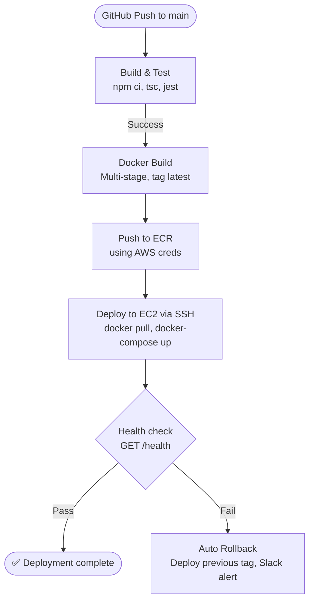

### 14.2 Frontend Pipeline (AWS Amplify)

**Trigger:** Push to `main` (Amplify webhook)

Amplify handles the full pipeline per app:
- Dependency install → Build (`next build` / `vite build`)
- Static asset deployment to CDN
- Invalidate CloudFront cache
- SSL certificate renewal

Separate `amplify.yml` per app configures build commands and environment variable injection.

---

## 15. Observability & Monitoring

### 15.1 Logging (Winston)

**Structured JSON logging** with level-based routing:

| Level | Destination |
|---|---|
| `info` | Console + daily rotating file |
| `warn` | Console + daily rotating file |
| `error` | Console + separate error log file |
| `debug` | Console only (dev mode) |

`winston-daily-rotate-file` rotates logs daily, retaining 14 days, with gzip compression.

HTTP request logs via `morgan` → piped into the Winston stream.

### 15.2 Health Check Endpoint

```
GET /api/v1/health
→ { status: "OK", uptime: 1234.5, timestamp: "...", environment: "production" }
```

Used by GitHub Actions post-deploy health gate and Docker's HEALTHCHECK instruction.

### 15.3 AWS CloudWatch

| What | How |
|---|---|
| Application logs | Docker logs → CloudWatch Logs via CloudWatch agent |
| System metrics | CPU, Memory, Disk — CloudWatch Metrics |
| Alarms | CPU > 80%, Disk > 85% → SNS → Slack notification |

### 15.4 Error Handling

Global error handler (`handleError`) normalises all thrown errors into the standard response envelope. Unhandled exceptions and unhandled promise rejections are caught at `process.on` level and logged before graceful exit.

---

## 16. Scalability & Performance

### 16.1 Current Performance Optimisations

| Technique | Where | Impact |
|---|---|---|
| Redis caching | Frequently read lookups | Reduces MongoDB round-trips |
| Multi-stage Docker build | Backend image | ~60% smaller production image |
| Nginx gzip | All HTTP responses | Reduces bandwidth |
| Next.js SSR/SSG | User app | Fast LCP, SEO-ready |
| Vite PWA | Partner/Admin apps | Offline resilience, fast reload |
| Amplify CDN | All 3 frontends | Global edge caching for static assets |
| Connection pooling | Mongoose | Reuses MongoDB connections |
| 15-min stale hold release | Availability engine | Prevents inventory freeze |

### 16.2 Scaling Path

**Vertical (immediate):**
- EC2: t3.medium → t3.large → t3.xlarge
- MongoDB Atlas: M0 → M10 → M20

**Horizontal (high traffic):**
- Add Application Load Balancer (ALB)
- Multiple EC2 instances in Auto Scaling Group
- Redis → ElastiCache (managed, replicated)
- Socket.IO: add Redis adapter for multi-instance broadcasting
- MongoDB Atlas: read replicas for analytics/reporting queries

### 16.3 Caching Strategy

```
Read path (cache-aside):
    Request
        │
        ├── RedisService.get(key)
        │       hit → return cached
        │
        └── miss → MongoDB → cache with TTL → return
```

Cache keys namespaced by domain (e.g., `property:{id}`, `destinations:all`).

---

## 17. Key Design Decisions

### 17.1 Monolith over Microservices

**Decision:** Single deployable Node.js application with internal service boundaries.

**Rationale:** At the current scale and team size, a well-structured monolith (with DI, interfaces, and layered architecture) provides faster iteration, simpler deployments, and zero network overhead between services. The internal interface boundaries make it straightforward to extract services later if needed.

### 17.2 tsyringe DI Container

**Decision:** Use `tsyringe` for IoC instead of manual factory functions.

**Rationale:** Enables runtime swapping of implementations (e.g., Gemini vs Tesseract OCR via env flag), clean unit testing with mock injection, and eliminates circular dependency issues common in large Node.js codebases.

### 17.3 Repository Pattern with Interfaces

**Decision:** All data access goes through an `IRepository` interface, with Mongoose implementations registered separately.

**Rationale:** Controllers and services are agnostic to the underlying database. This makes it trivial to swap Mongoose for Prisma, add caching in the repository layer, or test with in-memory fakes without touching business logic.

### 17.4 Dual OCR with Gemini as Primary

**Decision:** Gemini Vision (cloud) as default OCR, Tesseract (local) as fallback, toggled via `config.useGeminiOCR`.

**Rationale:** Gemini achieves significantly higher accuracy on Aadhaar card extraction (structured fields, multiple languages) vs raw Tesseract. The fallback ensures the KYC pipeline never fully fails even if the Gemini API is unavailable.

### 17.5 Per-Date Availability Documents

**Decision:** One `RoomAvailability` document per blocked date rather than storing date ranges.

**Rationale:** Enables granular custom pricing per date and makes availability checks O(1) per date lookup. Simplifies partial-cancellation and maintenance block logic compared to range-based records.

### 17.6 Encrypted Aadhaar at Rest

**Decision:** AES-encrypt all extracted Aadhaar fields before storage.

**Rationale:** Aadhaar numbers are classified as sensitive PII under Indian data protection law. Even if the MongoDB Atlas cluster or backups were compromised, the raw Aadhaar numbers remain unreadable without the encryption key (stored separately in AWS Parameter Store).

### 17.7 Platform Fee & Tax as SystemSetting

**Decision:** Store `platformFeePercent` and `taxPercent` as runtime-configurable values in a MongoDB SystemSetting singleton rather than environment variables.

**Rationale:** Allows admins to adjust fee structures without redeployment. Changes take effect immediately on the next price calculation request.

### 17.8 Passwordless Partner Login

**Decision:** Partners authenticate via email OTP only (no password).

**Rationale:** Partners are a smaller, trusted cohort where onboarding UX matters more than remembering a password. Eliminates the entire password reset surface area. The OTP is tied to their registered email, which is already verified during Aadhaar KYC.

---

## Appendix: Tech Stack Summary

| Category | Technology |
|---|---|
| **Runtime** | Node.js 20, TypeScript 5 |
| **Framework** | Express 4 |
| **User Frontend** | Next.js 16 (React 19, SSR) |
| **Partner/Admin Frontend** | React + Vite (PWA) |
| **Database** | MongoDB Atlas (Mongoose 7) |
| **Cache** | Redis (ioredis) |
| **Real-time** | Socket.IO 4 |
| **File Storage** | AWS S3 + multer-s3 |
| **AI/OCR** | Google Gemini 1.5 Flash · Tesseract.js |
| **Payments** | Razorpay |
| **Email** | Nodemailer (SMTP) |
| **Authentication** | JWT (jsonwebtoken) · Passport.js (Google OAuth) |
| **Authorization** | Custom JWT middleware · Role-based guards |
| **DI Container** | tsyringe |
| **Validation** | Joi · Yup |
| **Logging** | Winston + winston-daily-rotate-file · Morgan |
| **Security** | Helmet · express-rate-limit · bcryptjs |
| **Geocoding** | Nominatim (OpenStreetMap) — server-side proxy |
| **Maps** | react-leaflet |
| **Containerisation** | Docker (multi-stage) · Docker Compose |
| **Cloud** | AWS EC2 · AWS Amplify · AWS S3 · AWS ECR · AWS CloudWatch · AWS Parameter Store · Route 53 |
| **CI/CD** | GitHub Actions |
| **Reverse Proxy** | Nginx |
| **Styling** | TailwindCSS · Framer Motion |
| **Animation** | Framer Motion |

---

*Document maintained alongside the codebase. Update this file when significant architectural changes are made.*
